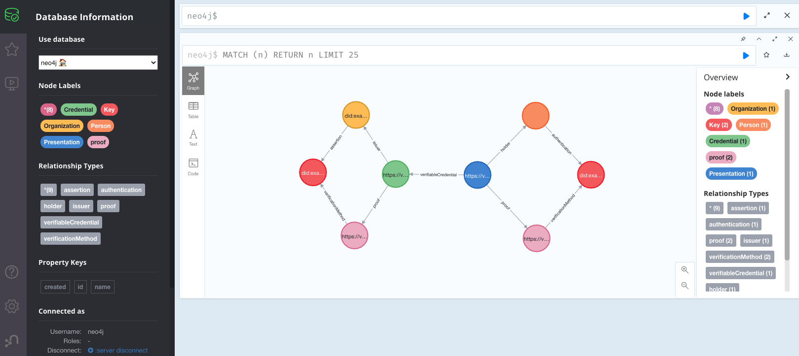

### Star Wars API + HyLar

- https://swapi.dev/
- https://github.com/ucbl/HyLAR-Reasoner
- https://neo4j.com/product/bloom/

- https://stackoverflow.com/questions/27627243/conversion-of-n-triples-to-cypher-text

This repo is for learning SPARQL, messing with linked data queries, and semantic reasoners, and graph databases...



#### Develop

```
npm i
npm run build
./run-neo.sh
npm run test
```

#### Curls

Beware that pagination may be required to get everything...

```
curl -s https://swapi.dev/api/films/ > ./films.json
curl -s https://swapi.dev/api/planets/ > ./planets.json
```
